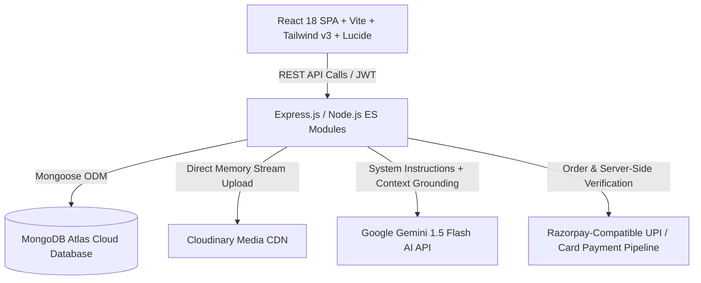
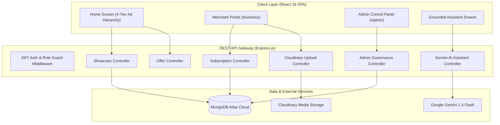

# PMNA Perks — Hyperlocal Offers Platform
## Comprehensive Technical Architecture & System Documentation

---

### Executive Overview & Project Identity
* **Project Name**: PMNA Perks (Perinthalmanna & Angadipuram Hyperlocal Offers)
* **Target Geos**: Perinthalmanna (PIN 679322) and Angadipuram (PIN 679321), Malappuram District, Kerala, India
* **Platform Classification**: Full-Stack Hyperlocal Commercial Discovery & Merchant Subscription Platform (MERN + Google Gemini 1.5 + Cloudinary + Razorpay Architecture)
* **Production Status**: Fully Operational, Database Connected (MongoDB Atlas), Automated Cloudinary Asset Pipeline, Server-Side Payment Verification

---

## 1. Introduction & Hyperlocal Problem Statement

### 1.1 The Hyperlocal Dilemma
In bustling Tier-2/3 commercial hubs like Perinthalmanna and Angadipuram, local retail businesses face significant digital marketing hurdles:
1. **Generic Aggregator Dilution**: Platforms like Swiggy, Zomato, or Amazon cater almost exclusively to standard food delivery or nationwide e-commerce, offering zero discovery for local footwear stores, textile boutiques, mobile accessory shops, or jewelry showrooms.
2. **Social Media Noise**: WhatsApp status updates and Instagram stories expire within 24 hours and fail to provide searchable, organized, or location-filtered deals.
3. **Advertising High Costs**: Traditional local newspaper advertisements (e.g., Malayala Manorama commercial display ads) charge substantial sums for a single morning print run that cannot provide direct digital navigation, click-to-call, or live updates.

### 1.2 The PMNA Solution
PMNA solves this by providing a unified, verified digital town center:
* **For Local Shoppers**: Free, high-speed access to real-time daily deals, long-term monthly savings, restaurant dining discounts, and warehouse clearance sales in Perinthalmanna and Angadipuram with zero generic filler.
* **For Local Merchants**: An affordable monthly subscription (default ₹99/month) giving each shopkeeper a dedicated front-page commercial showcase modeled after the familiar, trusted format of local newspaper display advertising, complete with Cloudinary banner hosting, direct Google Maps directions, and click-to-call actions.
* **For Town Administrators**: Complete governance, transaction logs, revenue tracking, and advertisement moderation.

---

## 2. Complete Technology Stack



### 2.1 Client Layer (Frontend)
| Component | Technology | Version | Purpose |
| :--- | :--- | :--- | :--- |
| **Framework** | React.js (Single Page Application) | 18.3.1 | Modular component architecture, hooks-driven state |
| **Build Tool** | Vite | 5.4.21 | Instant HMR dev server and optimized Rollup production bundling |
| **Routing** | React Router DOM | 6.23.1 | Declarative client-side routing, protected role layouts |
| **Styling** | Vanilla CSS + TailwindCSS | 3.4.4 | Curated SaaS color tokens (Emerald `#10B981`, Sky `#0EA5E9`), Inter font, Soft UI |
| **Iconography** | Lucide React | 0.383.0 | Modern, crisp SVG vector icons |
| **HTTP Client** | Axios | 1.7.2 | Interceptor-driven authenticated REST API requests |

### 2.2 Server Layer (Backend)
| Component | Technology | Version | Purpose |
| :--- | :--- | :--- | :--- |
| **Runtime** | Node.js | v24+ (ESM) | Non-blocking event-driven JavaScript server environment |
| **Framework** | Express.js | 4.19.2 | RESTful routing, middleware pipelining, error handling |
| **Database ODM**| Mongoose | 8.4.1 | Schema modeling, relationship population, validation |
| **Authentication**| JWT (`jsonwebtoken`) + `bcryptjs` | 9.0.2 / 2.4.3 | Salted password hashing (10 rounds) & Bearer Token authentication |
| **Media Pipeline**| Multer + Cloudinary SDK | 1.4.5 / 2.2.0 | Memory storage stream uploads, no local disk temporary leaks |
| **AI Engine** | `@google/generative-ai` | 0.14.0 | Real-time grounded local shopping assistant |

### 2.3 Cloud & Infrastructure
* **Database**: MongoDB Atlas Cloud Cluster (`ac-v0yf6tq-shard-00-00.4tqppem.mongodb.net`) with automated memory-server fallback.
* **Media Storage**: Cloudinary Media CDN with secure server-side API secret signature generation.
* **Payment Pipeline**: Razorpay-compatible UPI QR code scanner, UPI VPA (`pmna.perks@upi`), and card verification gateway.

---

## 3. High-Level System Architecture



---

## 4. PMNA Home Screen Hierarchy (Exact Implementation)

The PMNA front page is structured into a strategic 4-tier discovery layout:

```
PMNA HOME SCREEN
│
├── 1. DAILY DEALS & OFFERS
│      ├── Subscribed Shop Dedicated Showcases (Malayala Manorama Ad Style)
│      └── Limited-Time Flash Deals (Ending today / within 72 hours)
│
├── 2. MONTHLY DEALS & LONG-TERM OFFERS
│      └── Offers valid for an extended period (Month-long packages & festival passes)
│
├── 3. OTHER HOME CONTENT
│      ├── 3A. Explore by Category (Fashion, Footwear, Mobile, Jewellery, etc.)
│      ├── 3B. Grounded PMNA AI Local Discovery Assistant
│      ├── 3C. Popular Food & Dining Spots (Biriyani deals, family combos)
│      └── 3D. Verified Neighborhood Shops Directory
│
└── LAST SECTION: SHOP CLEARANCE & END-OF-STOCK
       └── Steep discounts, warehouse stock liquidation, last-size footwear & apparel bargains
```

### 4.1 Section Breakdown Details
1. **Tier 1 — Daily Deals & Offers**:
   * **Dedicated Shop Ad Boxes**: Subscribed shops get a prominent framed ad card featuring shop branding, verified shield, town tag, direct click-to-call, a 1200×600 promotional banner, floating discount badge, headline, and direct buttons (`View Offer`, `View Shop`, `Directions`).
   * **Limited-Time Store Deals**: Real-time flash discounts ending today or within 3 days.
2. **Tier 2 — Monthly Deals**:
   * Displays long-term campaigns (e.g. Month-Long Malabar Gold Jewellery Savings, 30-Day Family Banquet Dining Specials).
3. **Tier 3 — Other Home Content**:
   * Category directory with quick filters.
   * PMNA Assistant interactive query suggestions ("Find food under ₹200", "Any shoe offers today?").
   * Restaurant & dining showcase.
   * Approved neighborhood shop listings.
4. **Last Section — Shop Clearance**:
   * Highlighted in an amber-gold liquidation container.
   * High-contrast badges (`Steep Discounts`, `FLAT 55% OFF`, `60% OFF`).
   * Designed specifically for merchants clearing out end-of-season stock.

---

## 5. Shopkeeper Subscription & Revenue Model

### 5.1 Business Logic
* **Subscription Price**: Configurable dynamically by the Administrator (Default: ₹99 / month).
* **Validity**: 30 days from transaction timestamp. If renewed early, the 30-day period extends from the future expiry date.
* **Public Showcase Rule**: A shop's promotional display ad appears on the public Home Screen **if and only if**:
  1. `businessId.subscriptionStatus === 'active'`
  2. `businessId.subscriptionExpiresAt >= new Date()`
  3. `showcase.isActive === true`
  4. `showcase.adminDisabled === false`
* **Graceful Degradation**: If a subscription lapses:
  * The shop's promotional showcase is automatically hidden from the public Home page.
  * The merchant's shop account, catalog, and standard deals remain completely intact.
  * The merchant receives an alert on their dashboard with a 1-click renewal option.

### 5.2 Payment Flow
1. **Order Creation**: Merchant clicks "Subscribe / Renew Plan" → Server generates a unique order ID (`order_pmna_...`) and formal receipt number (`RCPT-XXXXX`).
2. **Interactive Gateway**: Merchant chooses UPI QR Code scanner, UPI VPA ID (e.g. GPay/PhonePe), or Card.
3. **Server Verification**: Server validates payment details, updates the `Subscription` and `Payment` documents, and sets `Business.subscriptionStatus = 'active'`.

---

## 6. Database Schema & Data Models

### 6.1 `Showcase` Model
| Field | Type | Attributes | Description |
| :--- | :--- | :--- | :--- |
| `businessId` | ObjectId | Ref: 'Business', Required, Unique | Associated merchant |
| `title` | String | Required, Max 120 chars | Promotional bold headline |
| `description` | String | Max 500 chars | Descriptive ad copy |
| `imageUrl` | String | Required | Cloudinary hosted URL or direct URL |
| `cloudinaryPublicId`| String | Optional | Cloudinary asset identifier |
| `discount` | String | Max 30 chars | Display badge (e.g. `FLAT 40% OFF`) |
| `startDate` | Date | Default: `Date.now` | Ad campaign start date |
| `expiryDate` | Date | Required | Ad campaign expiry date |
| `isActive` | Boolean | Default: `true` | Merchant visibility toggle |
| `adminDisabled` | Boolean | Default: `false` | Admin moderation suspension |
| `targetOfferId` | ObjectId | Ref: 'Offer', Optional | Linked specific store offer |

### 6.2 `Subscription` Model
| Field | Type | Attributes | Description |
| :--- | :--- | :--- | :--- |
| `businessId` | ObjectId | Ref: 'Business', Required | Associated merchant |
| `planId` | String | Default: `monthly_showcase_plan` | Plan identifier |
| `planName` | String | Default: `PMNA Showcase Monthly Plan` | Friendly plan name |
| `amount` | Number | Required, Default: 99 | Amount charged in INR |
| `currency` | String | Default: `INR` | Currency |
| `status` | String | Enum: `active`, `expired`, `cancelled` | Plan lifecycle state |
| `startDate` | Date | Required | Plan activation date |
| `expiryDate` | Date | Required | Plan expiration date (+30 days) |
| `paymentId` | String | Required | Gateway transaction ID |

### 6.3 `Payment` Model
| Field | Type | Attributes | Description |
| :--- | :--- | :--- | :--- |
| `businessId` | ObjectId | Ref: 'Business', Required | Associated merchant |
| `subscriptionId` | ObjectId | Ref: 'Subscription', Required | Linked subscription |
| `paymentGateway` | String | Default: `Razorpay` | Payment processor |
| `orderId` | String | Required, Unique | Order reference ID |
| `paymentId` | String | Required, Unique | Transaction ID |
| `amount` | Number | Required | Amount paid in INR |
| `currency` | String | Default: `INR` | Currency |
| `status` | String | Enum: `pending`, `successful`, `failed` | Payment status |
| `paymentMethod` | String | Enum: `UPI`, `UPI_QR`, `CARD`, `NETBANKING`| Method used |
| `receiptNumber` | String | Required, Unique | Tax receipt number (`RCPT-XXXXX`) |
| `billingPeriod` | Object | `{ startDate, endDate }` | Covered billing dates |

---

## 7. REST API Endpoint Catalog

### 7.1 Showcase Endpoints (`/api/showcases`)
* `GET /api/showcases/public?location={slug}`: Returns active showcases filtered strictly for active, paid merchants.
* `GET /api/showcases/me` *(Protected: Merchant)*: Retrieves current merchant's showcase and subscription state.
* `POST /api/showcases/me` *(Protected: Merchant)*: Creates or updates the merchant's promotional showcase.
* `PATCH /api/showcases/me/toggle` *(Protected: Merchant)*: Enables or pauses the showcase visibility.

### 7.2 Subscription & Payment Endpoints (`/api/subscriptions`)
* `GET /api/subscriptions/status` *(Protected: Merchant)*: Returns subscription status, days remaining, and current price.
* `POST /api/subscriptions/create-order` *(Protected: Merchant)*: Initializes Razorpay-compatible payment order.
* `POST /api/subscriptions/verify-payment` *(Protected: Merchant)*: Verifies transaction and activates 30-day subscription.
* `GET /api/subscriptions/payments` *(Protected: Merchant)*: Retrieves merchant payment history with tax receipts.

### 7.3 Admin Endpoints (`/api/admin`)
* `GET /api/admin/subscriptions/overview` *(Protected: Admin)*: Returns financial metrics, subscribed shops list, and logs.
* `PUT /api/admin/subscriptions/price` *(Protected: Admin)*: Dynamically updates showcase monthly subscription price.
* `GET /api/admin/showcases` *(Protected: Admin)*: Lists all showcases for administrative inspection.
* `PATCH /api/admin/showcases/:id/toggle` *(Protected: Admin)*: 1-click moderation disable/enable for any ad space.

### 7.4 Media Upload Endpoints (`/api/upload`)
* `POST /api/upload/showcase` *(Protected: Merchant)*: Authenticated multipart upload streaming banner images to Cloudinary.

---

## 8. Grounded AI Assistant Architecture

The PMNA AI Assistant uses Google Gemini 1.5 Flash with strict database-grounded system prompting:
1. **Dynamic Context Injection**: Every prompt dynamically pulls verified shops, active offers, category mapping, and town locations.
2. **Zero Hallucination Constraint**: The prompt strictly instructs the model never to fabricate store names, phone numbers, or discounts not present in the current database snapshot.
3. **Hyperlocal Contextual Understanding**: Capable of answering questions like *"Where can I get dum biriyani in Perinthalmanna for lunch?"* or *"Show shoe offers in Angadipuram"*.

---

## 9. Security & Production Readiness

* **Zero Cloudinary Secret Exposure**: Cloudinary credentials (`API_SECRET`, `API_KEY`) reside exclusively in the server environment. The frontend only receives uploaded image URLs.
* **Salted Password Encryption**: All passwords pass through `bcryptjs` with 10 salt rounds before storage.
* **Strict Role-Based Access Control (RBAC)**: JWT tokens are validated through Express middleware (`protect`, `authorize('business')`, `authorize('admin')`).
* **Clean Production Builds**: Frontend compiles cleanly under Vite Rollup with zero syntax or CSS errors.
